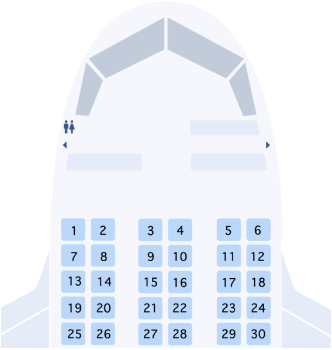

# Problema B - ¡Pero qué caradura!

Cuando viajo en avión me ocurre con cierta frecuencia que un pasajero se acerca a mí antes de que comience el vuelo y me pide muy amablemente si puedo cambiarle el asiento ya que es muy amigo del pasajero que se sienta a mi lado y le gustaría realizar el viaje con él. A continuación, el pasajero que se sienta a mi lado, con una amplia sonrisa se esfuerza en explicarme que no pudieron reservar los asientos juntos debido a una serie de problemas que nunca alcanzo a comprender. En esta situación es difícil negarse al intercambio, y luciendo mi mejor sonrisa, accedo a cambiar de asiento y recojo mis pertenencias.

Cuando pregunto al pasajero que se acercó a mí dónde se encuentra el suyo para realizar el cambio, quedo asombrada cuando afirma que se encuentra en la última fila del avión. Es
el momento en que la sonrisa se trunca en una mueca extraña. ¡Vaya caradura! Quiere que abandone mi posición en la parte delantera del avión y vaya atrás, donde el ruido de los motores no me dejará conciliar el sueño.

Afortunadamente ya conozco la jugada y reacciono a tiempo. “¿Qué tal si en lugar de ser yo la que se vaya a la parte de atrás, es tu amigo — digo señalando a la persona que tengo a mi lado — el que lo hace? Seguro que tu compañero de fila que ahora mismo está solo detrás preguntándose para qué te has levantado está encantado de venirse a mi lado y ganar tranquilidad”.

En el vuelo que nos ocupa, hay muchos pasajeros que quieren cambiar de asiento. Para que no terminemos todos de pie por los pasillos, la tripulación ha puesto orden y vamos a ir haciendo las solicitudes en secuencia: se levantará una persona y se dirigirá a otra para proponerle el cambio; tras hacerlo se procede con la siguiente solicitud y así hasta terminarlas todas. Los cambios de asientos siempre tienen lugar aunque unas veces se intercambiarán los implicados en la solicitud (si el que la recibe no tiene que ir hacia atrás en el avión) y otras veces serán los pasajeros que ocupan sus butacas contiguas los que se intercambiarán.

La disposición de los asientos en el avión es siempre la misma. Hay 6 asientos en cada fila, colocados de dos en dos y separados por dos pasillos. El número de filas varía de un vuelo a otro. Los asientos se numeran consecutivamente por cada fila, empezando por la fila uno. Así los asientos de la primera fila se numeran del 1 al 6 empezando por un extremo. Los de la segunda fila son los asientos del 7 al 12, estando el asiento 7 detrás del 1, y así sucesivamente hasta completar el avión. Los pasajeros se numeran inicialmente por el asiento que ocupan. Luego no vuelven a cambiar de número aunque cambien de asiento.



## Entrada
La entrada consta de una serie de casos de prueba. Cada caso comienza con una línea con dos valores.
El primero indica el número de filas, $F$, del avión $(1 \le F \le 30)$ y el segundo el número de cambios que se producen (es posible que no se produzca ningún cambio). Por cada cambio aparece en una línea el número de asiento del pasajero que pide el cambio y el número de asiento del pasajero al que le pide el cambio. La entrada termina con dos ceros.

Un pasajero nunca pide cambio a sí mismo, ni al pasajero a su lado. Además, una vez que una pareja de conocidos ha conseguido sentarse junta no volverá a pedir cambios ni nadie se los pedirá (todos los pasajeros tienen como mucho un amigo en el avión).

## Salida
Para cada caso de prueba se escribirá en $F$ líneas la disposición de los pasajeros una vez realizados todos los cambios. En cada línea se muestra una fila del avión. Después de la descripción de cada avión se escribirá una línea con tres guiones.

## Entrada de ejemplo
```
2 2
1 8
10 4
3 3
9 5
1 18
11 7
2 2
9 5
11 5
0 0
```

## Salida de ejemplo
```
8 2 9 4 5 6
7 1 3 10 11 12
---
18 2 3 4 5 10
11 8 9 6 7 12
13 14 15 16 17 1
---
1 2 3 4 5 12
7 8 9 6 11 10
---
```
